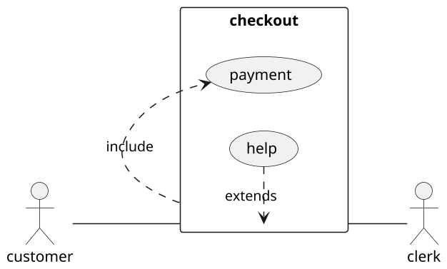

# Tools

# Building Blocks

## Structural Things

- Class
- Interface
- c

```puml
@startuml
scale 1.5
left to right direction
skinparam packageStyle rectangle
actor customer
actor clerk
rectangle checkout {
  customer -- (checkout)
  (checkout) .> (payment) : include
  (help) .> (checkout) : extends
  (checkout) -- clerk
}
@enduml
```
